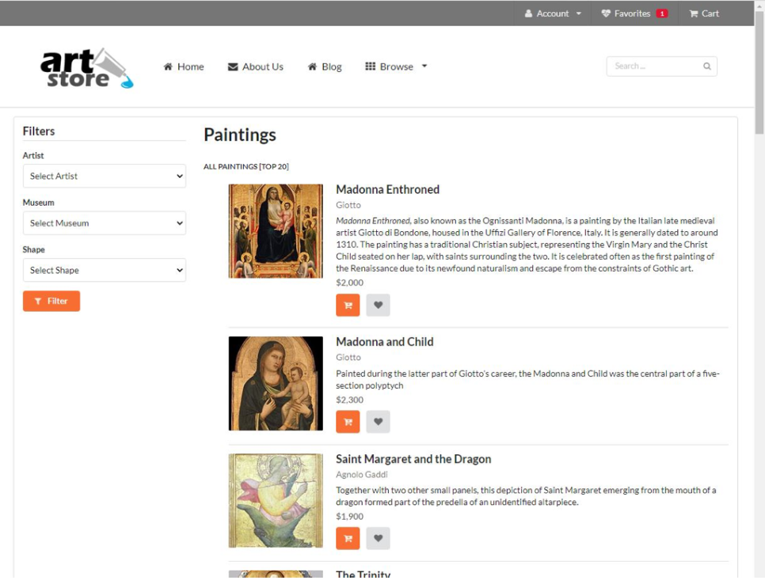

# Assignment 3: PHP, SQL, State, Caching

## Issues 
This repository does not contain any images for all the artwork found in the database because there are too many images to fit in the repository. As a result, when the code is run errors will be thrown because images are not found. 

## Problem Statement 

### PHP and SQL
Replace the static HTML documents with pages that dynamically create pages, pulling in information from multiple database tables. 

1. Create PHP versions of the two supplied HTML files, named `browse-paintings.php` and `single – painting.php`. Extract the common header into a separate include file.

2. Retrieve information to populate the HTML that is being returned to the client. Generalize your database retrieval code into separate classes.

3. The `browse-paintings.php` page will initially potentially display all the paintings in the Painting table. However, because there are hundreds of paintings, only show the top 20. Each of the images shown must be links to the appropriate query string to the single- painting.php page. The user should be able to filter the list by specifying the artist or museum or shape in the three drop-down lists, populated from the `Artists` (sorted by last name), `Museums` (sorted by gallery name), and `Shapes` (sorted by shape name) tables. As with the unfiltered list, only display the top 20 matches for the filter. Assume that the user will filter only by one of `Artists`, `Museums`, or `Shapes`.

4. `Single-painting.php` displays the information about a single painting (specified via the id passed in via a query string parameter). This page needs to display data from some other tables (`Galleries`, `Genres`, `Subjects`, and `Reviews`). The `Frame`, `Glass`, and `Matt` select lists should be populated from the appropriate tables (`TypesFrame`, `TypesGlass`, `TypesMatt`). `Single-painting.php` should handle a missing or noninteger query string parameter by
displaying a default painting.

5. Add ability to navigate from `browse-paintings.php` to `single-painting.php` by clicking
on an image. To return from `single-painting.php` back to `browse-paintings.php`, select `Paintings` under the `Browse` pull-down menu in the header. The static versions of these two pages have many other links that will not lead to any page you will have access to. It is okay if the server, when the user selects one of these links, returns an error message.

Output generated by `browse-paintings.php` without filtering is shown below:

### State Management

Add functionality to implement a favorite paintings list using a session variable:

1. Both `browse-paintings.php` and `single-painting.php` contain Add to Favorites links styled as buttons. Modify these links so that clicking on them will take the user to `addToFavorites.php`. These links need to indicate which painting to add to the favorites via a query string. To make the view favorites page easier to implement, the query string should include `PaintingID`, `ImageFileName`,
and `Title`.

2. Create `addToFavorites.php`, which will handle a `GET` request to add a painting to the favorites list.This file will contain no markup: it will check for the existence of the relevant query string fields, and then add the painting information to the session state.

3. Each favorite item will be an array that contains the `PaintingID`, `ImageFileName`, and `Title` fields for the painting. You will need to retrieve the favorites array from session state (or create it if it does not exist), and then add the array for the new item to the favorites array. You must then store the modified favorites array back in session state. After this, redirect to `view-favorites.php` using the header() function.

4. Create `view-favorites.php`. It should display, for each painting in the favorites list, a small version of the painting and its title. Make the title a link to `single-painting.php` with the appropriate query string.

5. Change the button links that will remove each painting from the favorites list as well as the button link to empty all the favorites from the list. These will be links to `remove-favorites.php`; for the remove single painting links, the `PaintID` of the painting to be removed will be provided as a query string parameter.

6. Create `remove-favorites.php`, which will handle a `GET` request to remove a single painting from the favorites list. It will check for the existence of the relevant query string parameter and then remove the specified paintings from the favorites array in session state. After removing, redirect back to the     `view-favorites.php` page.

7. Modify the header common to all files with markup to display a count of the items in the favorites list

### Caching 

`browse-paintings.php` has three filters that require three separate SQL queries. The data in these tables would likely change infrequently. Performance can improved if we cache the data from these three tables. Only when the data is not cached in `memcache` would you go and retrieve it from the database server.

## Usage 

- **Prerequisites**: 
    - Install `memcache`and its daemon with the correct PHP extensions
    - Must have the same database with required tables
- Run the `XAMPP MySQL Server` and have `MariaDB` running with the `art` database loaded. The user account uses the following credentials: 
    - Name: `testuser`
    - Password: `mypassword`

- Run `browse-paitings.php`