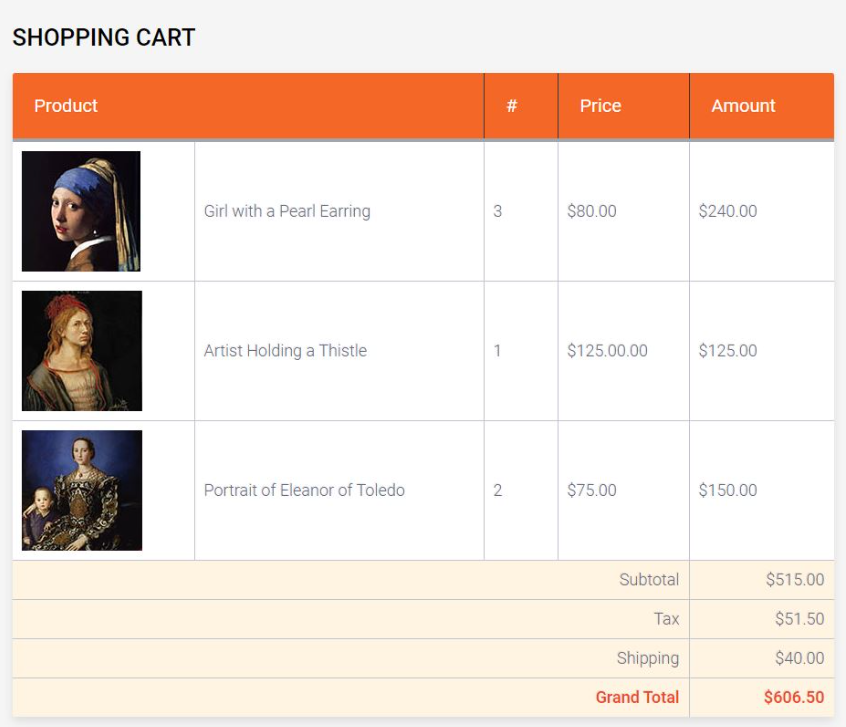

# Lab 3: JavaScript

## Problem Statement 

The task will be to replace the markup for the three images with a JavaScript loop, as described below. 

1. Examine the data file `data.js`. It contains four arrays that you are going to use to programmatically generate the data rows, replacing the hard-coded markup.

2. In the file `functions.js` create a function called `calculateTotal()` that is passed a quantity and price and returns their product.

3. Within `functions.js`, create a function called `outputCartRow()` that should use `document.write()` calls to display a row of the table using the passed data.

4. Replace the three cart rows in the original markup with a JavaScript that calls `outputCartRow()`. Put this loop in a file called `ArtStore.js` in the js subdirectory.

5. Calculate the subtotal, tax, shipping, and grand total using JavaScript. Use 10% as the tax amount. The shipping should be $40 unless the subtotal is above $1000, in which case it will be $0.

Sample output: 

## Usage 

- Open `lab3.html` in a browser