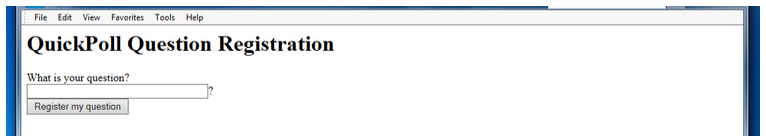

# Lab 6: Managing State

## Problem Statement 

Design and implement a simple polling application that has the following features

1. A page `register.html` allows a user to register a simple yes/no question. Every time a new question is registered, the vote tallies will be reset to zero.

2. Once that question has been submitted, the user is prompted to answer the question, using radio buttons (allowing only “Yes” or “No” as answers).

3. Once a user registered a vote, a page will be displayed that will tally the current yes and no votes. Also, the user is given the opportunity to vote again or to register a new question. 

## Usage 

- Launch the XAMPP Apache Server 
- Run `lab6.html` in a browser